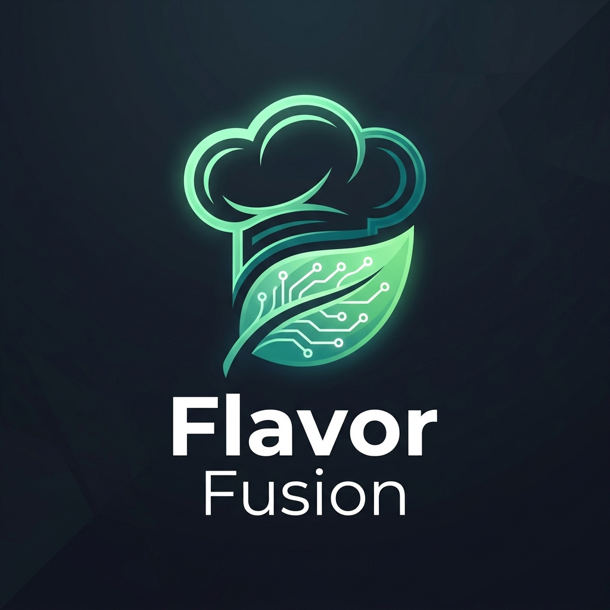
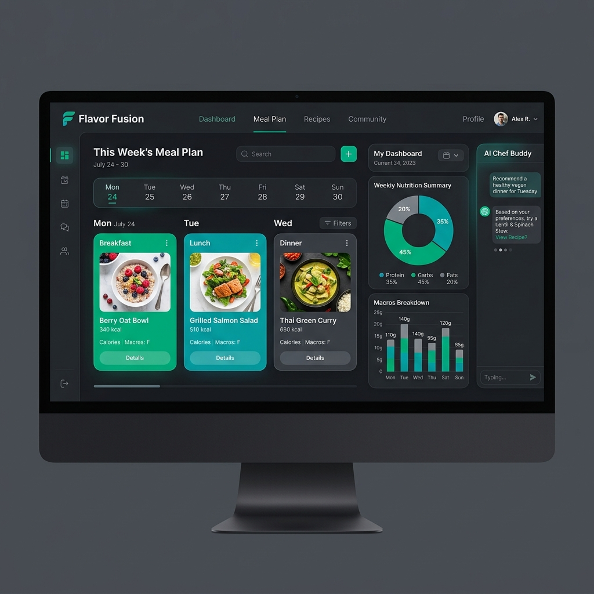

# 🥗 Flavor Fusion

<p align="center">
  
</p>

<p align="center">
  
  
  
  
  
</p>

---

## 🌟 Overview
**Flavor Fusion** is a premium, AI-driven nutrition and wellness ecosystem designed to bridge the gap between medical needs and culinary delight. It leverages **Groq's Llama 3** to generate scientifically-backed, clinical-grade meal plans tailored to specific health conditions, dietary preferences (including Jain, Vegan, Keto), and personal goals.



## ✨ Key Features

-   🤖 **AI Meal Generation**: Personalized 1-day meal plans focused on Medical Nutrition Therapy (MNT).
-   🏥 **Clinical Intelligence**: Supports conditions like Diabetes, Hypertension, and PCOS with proactive clinical risk alerts.
-   💬 **Personalized AI Nutritionist**: A 24/7 chat assistant for nutritional advice, recipe modifications, and health queries.
-   🏋️ **Tailored Exercises**: Curated workout library filtered by health impact and personal conditions.
-   📊 **Macro Precision**: Real-time tracking of calories, protein, fats, and carbs vs. personal goals.
-   🥗 **Dietary Diversity**: Native support for Jain, Keto, Vegan, Mediterranean, and Sattvic diets.
-   🌗 **Modern UI**: Sleek, glassmorphic dark-mode interface built for performance and accessibility.
-   📋 **Health Reports**: PDF generation for meal plans and progress tracking.

## 🚀 Tech Stack

-   **Frontend**: React 18, Vite, TypeScript
-   **AI Engine**: Groq API (Llama 3.3-70b)
-   **Styling**: Tailwind CSS, Framer Motion (Animations)
-   **UI Components**: Radix UI, Shadcn UI, Lucide Icons
-   **Data Visualization**: Recharts
-   **State Management**: TanStack Query (React Query)
-   **Schema Validation**: Zod
-   **Forms**: React Hook Form

## 🛠️ Installation & Setup

1.  **Clone the repository**:
    ```bash
    git clone https://github.com/Amith1417/flavor-fusion-plans.git
    cd flavor-fusion-plans
    ```

2.  **Install dependencies**:
    ```bash
    bun install
    # or
    npm install
    ```

3.  **Environment Variables**:
    Create a `.env` file in the root directory and add your Groq API key:
    ```env
    VITE_GROQ_API_KEY=your_groq_api_key_here
    ```

4.  **Run the development server**:
    ```bash
    bun dev
    # or
    npm run dev
    ```

## 📂 Project Structure

```text
src/
├── components/     # Reusable UI molecules & atoms
├── data/           # Mock data and exercise libraries
├── hooks/          # Custom React hooks
├── lib/            # External API integrations (AI, etc.)
├── pages/          # Full page components & routing
└── types/          # TypeScript definitions
```

## 🤝 Contributing

Contributions are what make the open-source community such an amazing place to learn, inspire, and create. Any contributions you make are **greatly appreciated**.

1. Fork the Project
2. Create your Feature Branch (`git checkout -b feature/AmazingFeature`)
3. Commit your Changes (`git commit -m 'Add some AmazingFeature'`)
4. Push to the Branch (`git push origin feature/AmazingFeature`)
5. Open a Pull Request

## 📄 License

Distributed under the MIT License. See `LICENSE` for more information.

---

<p align="center">
  Built with ❤️ by the Flavor Fusion Team.
</p>
